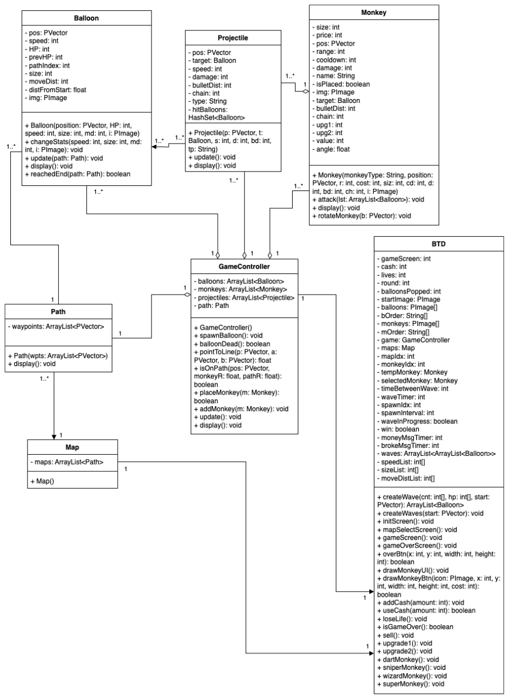

# Project Name: Bloons Tower Defense -1
**Group Name**: 3 monkeys  
**Group Members**: Yuhang Pan, Michael Lee, Kyle Liu  
**Period**: 6

---

## Description:
A completely original tower defense game where players must defend against waves of balloons using monkeys. The game will feature a wave system, a cash system to buy and place monkeys, and models for monkeys and balloons, etc.

---

## Functionalities:
- Cash system (a total cash counter, popping balloons and completing waves gives cash and placing monkeys requires a specific amount)  
- Wave system  
- Place towers / send out waves  
- Tower upgrades, multiple paths  
- Health system (lose when lives = 0, and lose lives if balloons escapes)  
- UI, start/pause/resume game  

---

## Classes:
- Balloon (hp (color), speed), including its position and next waypoint  
- Monkey (cost, damage, cd, attack range), shoots a projectile when balloon is in range  
- Projectile (targets a balloon)  
- Path (list of waypoints with a final endpoint to check if a balloon has reached the end)  
- Map (arraylist of paths containing different waypoints)  
- Game Controller (makes path, spawns balloons, update position of balloons and projectiles)  
- BTD (main game: #cash and #lives)  

---

---

## How to play:
Defend your base from waves of balloons by placing monkeys that will pop them. Each popped balloon earns you cash, which can be used to place more monkeys. Survive all the waves before too many balloons reach your base.  

**General gameplay**  
Place a monkey: click on a monkey and click on a valid position to place  
Start wave: it could also automatically start after a timer  
Monkeys will pop the balloons → earn cash → place monkeys  

**Win/Lose**  

**Controls**  
LMB (place) can do everything  
1: Select Dart Monkey  
2: Select Sniper Monkey  
3: Select Wizard Monkey  
4: Select Super Monkey  
Q: Upgrade 1 (more damage)  
E: Upgrade 2 (better range & cd)  
X: Sell Selected Monkey  

---

## Progress check 1:
**Added Functionalities:**  
Added a start screen with a start button that can be clicked to start the game  
Added a path for the balloons to move on  

**Plans for next progress check:**  
Balloons moves across the track  
A predefined arraylist of balloons for all the waves  
Monkey placing system  
Monkey detecting balloons in its range  
UI for selecting balloons  

**What each person did:**  
Yuhang: added start screen, added path, added outline for Projectile and main class.  
Kyle: collected all the necessary images for balloons, added the outline for the Balloon class  
Michael: added code for detecting if monkeys are on the path, added the outline for the Monkey class  

---

## Progress check 2:
**Added Functionalities:**  
Added game screen, with buttons to place monkeys and stats like cash, lives, and the wave  
Added game over screen if the game ends  
Made balloons to move along the track going through each waypoint, also checked if reached the last waypoint  
Added checking valid monkey placements and placing monkeys  
Added monkey targeting and attacking balloons  
Added projectiles moving towards target balloons  
Set waves of balloons  

**Plans for next progress check:**  
More monkeys and add upgrades for monkeys  
More types of balloons  
Keybinds  
Targeting methods for monkeys  
End screen with stats  

**What each person did:**  
Yuhang: added start screen, added end screen, added waves of balloons, added monkey placing  
Kyle: added update and display balloons to move balloons along the path, also added destroy balloon if hp = 0  
Michael: added monkey targeting and attacking, and update and display monkeys  

---

## Final Product:
**Added Functionalities:**  
More maps to choose from  
Selecting monkeys (and upgrading/selling them)  
Keybinds for placing monkeys & upgrade & sell  
Monkeys and projectiles orient themselves facing the balloon  
Improved monkey range circle  
Revamped the balloon system (including balloon spawning/taking damage/popping)  
Added new wizard monkey that chains attacks onto multiple balloons  

**What each person did:**  
Yuhang: added timer between waves, added maps, oriented projectiles, more ui, selecting selling upgrading monkeys, keybinds  
Kyle: added play button, improved balloons, now they lose hp properly and “pop” properly, game balancing  
Michael: added range of monkeys when placing them, properly oriented the monkeys to face the target balloon when they attack, fixed projectile spawn location, wizard monkey  
